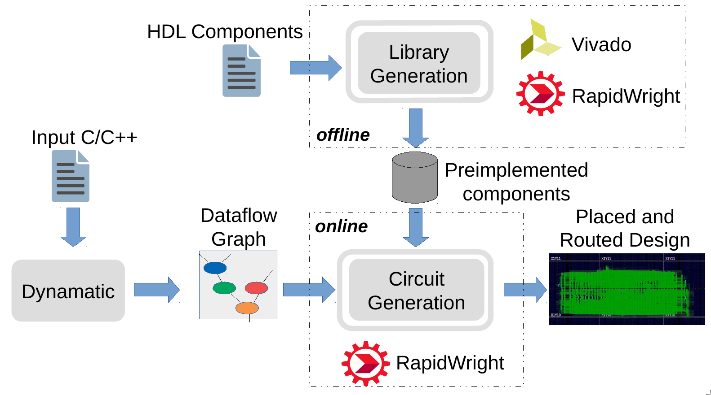

#  DynaRapid Setup Instructions

DynaRapid is a fast compilation tool that generates placed and routed designs for AMD FPGAs in a matter of seconds. 



## Getting started

The DynaRapid's circuit generation requires [RapidWright](https://www.rapidwright.io/) to run. 
To install RapidWright follow the following steps.

## Installing RapidWright

RapidWright can be installed using the following commands:

```
git clone --branch ag https://github.com/Xilinx/RapidWright.git
cd RapidWright
./gradlew compileJava
echo "export CLASSPATH=`pwd`/bin:`pwd`/jars/*" > bin/rapidwright_classpath.sh

```

To test if RapidWright is correctly installed or not, use the following commands (from the above directory):

```
bash
source bin/rapidwright_classpath.sh
java com.xilinx.rapidwright.device.browser.DeviceBrowser

```
This must open up a device Browser GUI. This confirms that RapidWright works fine. You can now close it.

## Installing DynaRapid

The following steps are required from **within the RapidWright** directory

```
cd RapidWright
git clone https://github.com/DynaRapid/DynaRapid
echo "export CLASSPATH=`pwd`/bin:`pwd`/jars/*:`pwd`/DynaRapid/bin/" > bin/rapidwright_classpath.sh
source bin/rapidwright_classpath.sh
cd DynaRapid
make

```
If the above commands work, you can go ahead and start testing


If DynaRapid is compiled correctly, we can now start changing the environment variables in DynaRapid to get the code running

## Changing DynaRapid envronment variables
To change the environment variables of the code, we need to change a few fields in the file settings.env to adapt the path to your installation.
You can change it by hand, on just running the command below. 

```
sh dynarapid_setup.sh

```


## Running DynaRapid
To test if DynaRapid is working correctly or not, we can try generating a design from many dot files that exist in the ./dotfiles/ folder.

### Test 1: (Generating Designs with in-built placer)
This test should generate a valid design using the simple_graph.dot file. This uses the in built placers of the toolflow. 
The options for the placer are rudimentary and greedy. Either of them can be used to generate designs. Here rudimentary is used for examples. Follow the commands:

```
java GenerateDesign -f ../dotFiles/simple_graph.dot -placer rudimentary

```

or 

```
java GenerateDesign -f ../dotFiles/simple_graph.dot -placer greedy

```

If DynaRapid is installed correctly, this code should run to completion and you will find a folder with the name of "simple_graph" in the designs folder. This folder should have:

```
- [ ] simple_graph.dot
- [ ] simple_graph_routed.dcp
```

The final simple_graph_routed.dcp file can be opened with Vivado.


